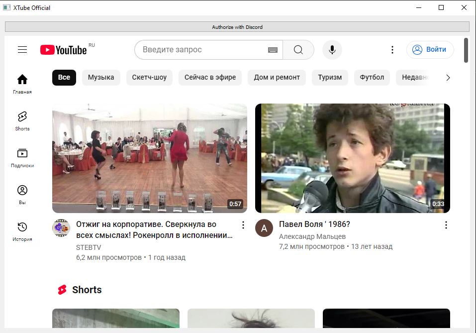

# XTube

Простое приложение для просмотра видео с YouTube, интегрированное с YouTube API.

## Описание

Это приложение позволяет пользователям искать и просматривать видео с YouTube прямо в браузере. Оно использует YouTube API для поиска видео по запросу и отображения результатов в виде карусели с видео.

## Особенности

- Интуитивно понятный интерфейс
- Поиск видео по ключевым словам
- Воспроизведение видео в плеере
- Простой и стильный дизайн
- Реализовано с использованием Python и pyqt5

## Скриншоты

  
*Главная страница приложения.*

